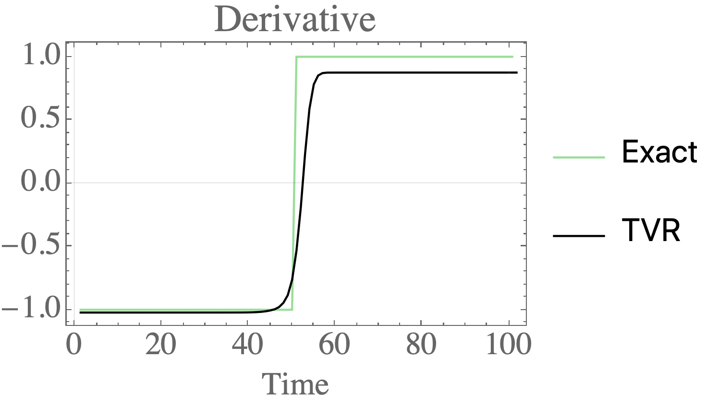
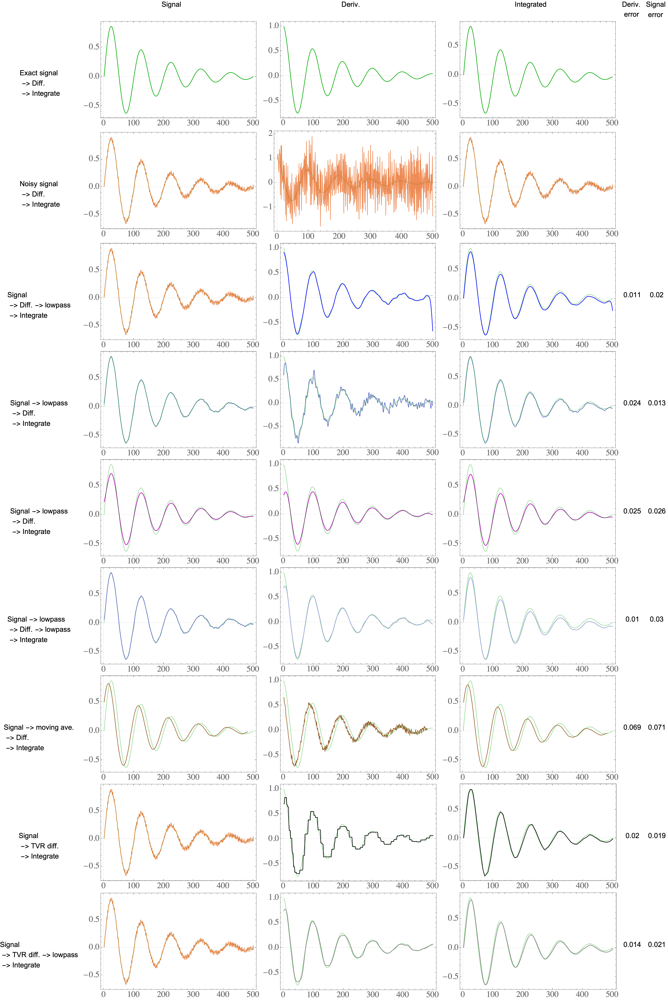

# Differentiate noisy signals with Total Variation Regularization (TVR) in Python and Mathematica

This repo gives an implementation with examples of how to differentiate noisy signals using Total Variation Regularization (TVR).

[You can read more about this on Medium.](https://medium.com/practical-coding/how-to-differentiate-noisy-signals-2baf71b8bb65)

Here's a quick example of a signal:

it's noisy derivative:

and it's amazingly smooth derivative from TVR:

## Code

* [mathematica](mathematica) contains an implementation in Mathematica. The example is worked out here in greater detail.
* [python](python) contains an implementation in Python. This is a fairly basic implementation, so be careful applying it to large problems (1k+ data points).

## Relevant literature

This code heavily uses the method described in [Numerical Differentiation of Noisy, Nonsmooth Data](literature/164564.pdf). A good description of the lagged diffusivity algorithm can be found in one of the references: [Chapter 8 - Total Variation Regularization](literature/chapter_8.pdf).

## Detailed example

[You can read more about this on Medium.](https://medium.com/practical-coding/how-to-differentiate-noisy-signals-2baf71b8bb65)

