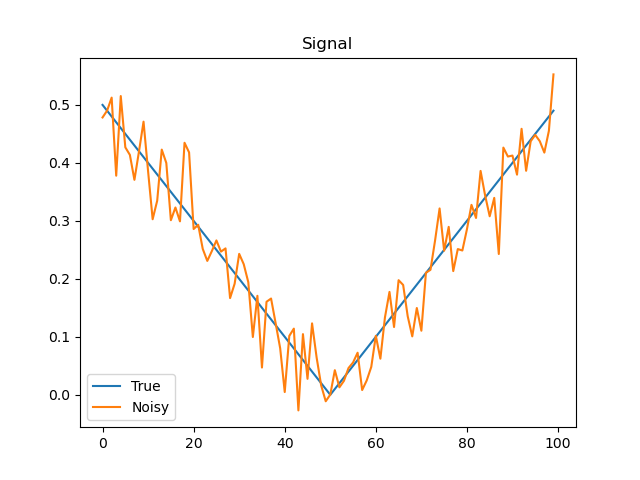
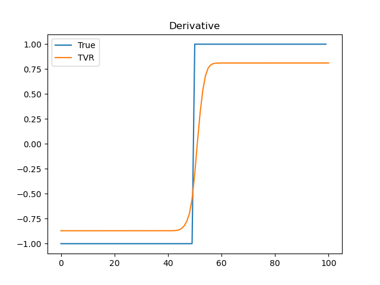

# Python implementation

[You can read more about this on Medium.](https://medium.com/practical-coding/how-to-differentiate-noisy-signals-2baf71b8bb65)

This directory contains a very rudimentary implementation of differentiation of noisy signals with total variation regularization.

**It is not suitable for large problems. See alternative method in paper in literature folder.**

* `diff_tvr.py` contains the differentiation class. 
* `example_abs.py` contains an example for differentiation a noisy absolute value. 

